# Cascadia Proteomics Symposium, July 23-24, 2018

## Institute for Systems Biology, Seattle WA

---

Wilmarth_CPS_2018.pptx - Talk Powerpoint with notes

Wilmarth_Cascadia_2018.pdf - Talks slides

---

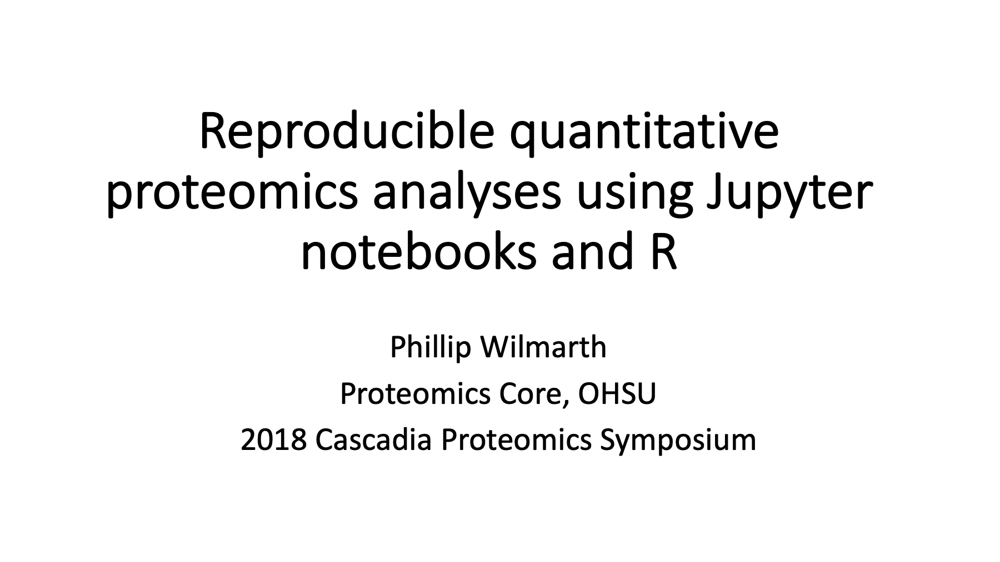

I would like to thank the organizers.

---

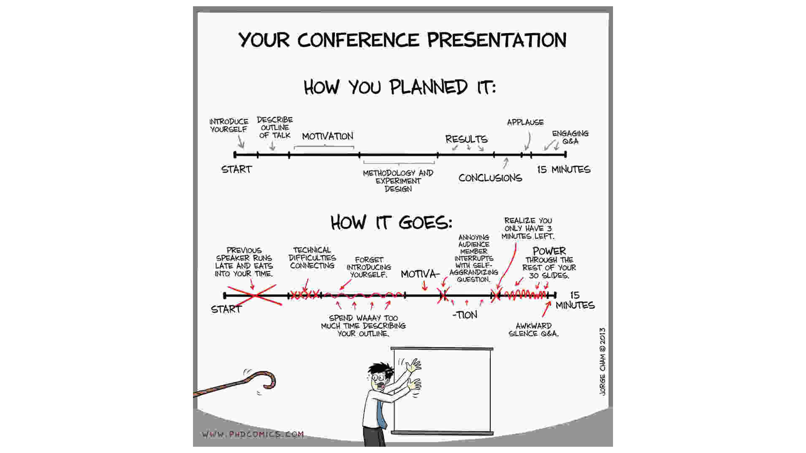

Like many of you, I am not too excited to be on this side of the podium. Let's hope the talk goes like planned...

---

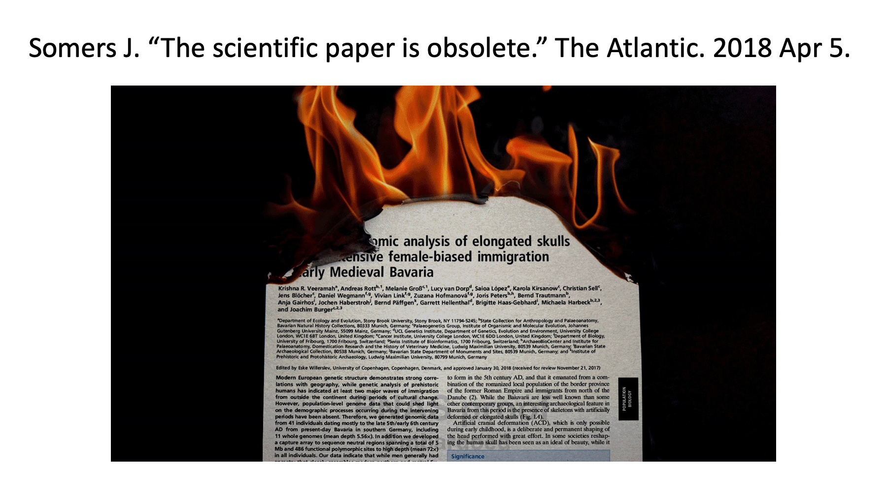

I spent much of the winter creating notebooks to explain TMT data normalization and statistical testing. They are available on Github (www.github.com/pwilmart). Around the time the call for abstracts for this meeting went out, there was this Atlantic article claiming that notebooks could replace papers. That made me think that a little introduction to notebooks would be fun.

---

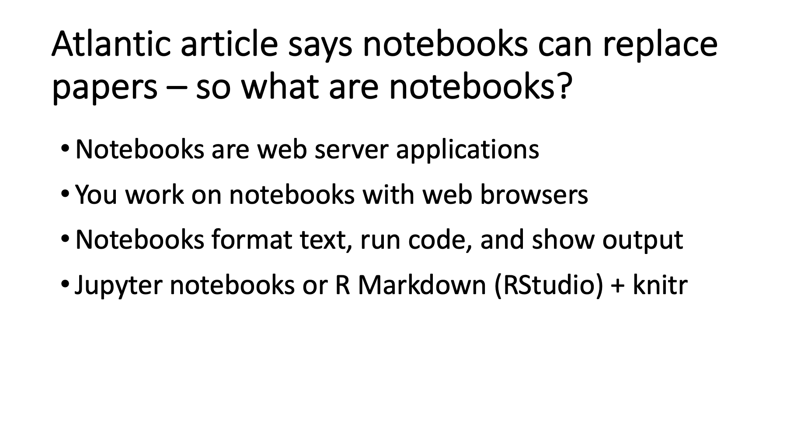

The Atlantic article claims that notebooks can replace traditional scientific papers. What kind of notebooks are they talking about? They are not electronic lab notebooks, nor are they similar to Evernote notebooks. The notebooks are like Mathematica notebooks and their newer open source variant Jupyter notebooks. These notebooks are web server applications with some connection to a local programming environment. You create and interact with notebooks through web browsers. Notebooks can render rich text formatting, execute code blocks (typically Python or R), and display the output (graphics and text) from the code blocks. I will show you Jupyter notebooks today, but R Markdown in RStudio is conceptually very similar.

---

Before you can launch notebooks, you have to install the webserver application stuff. If you install a scientific Python distribution like Anaconda, you get Jupyter notebooks to go with numpy, matplotlib, pandas, scipy, scikit learn, etc. Scientific Python distributions have many packages that are not part of the standard Python library. Anaconda makes it easier to install all of these and keep them updated. Anaconda and all of the major packages including Jupyter notebooks (www.jupyter.org) have extensive online documentation. Python support is included by default; however, support for R takes some extra installation steps.

---

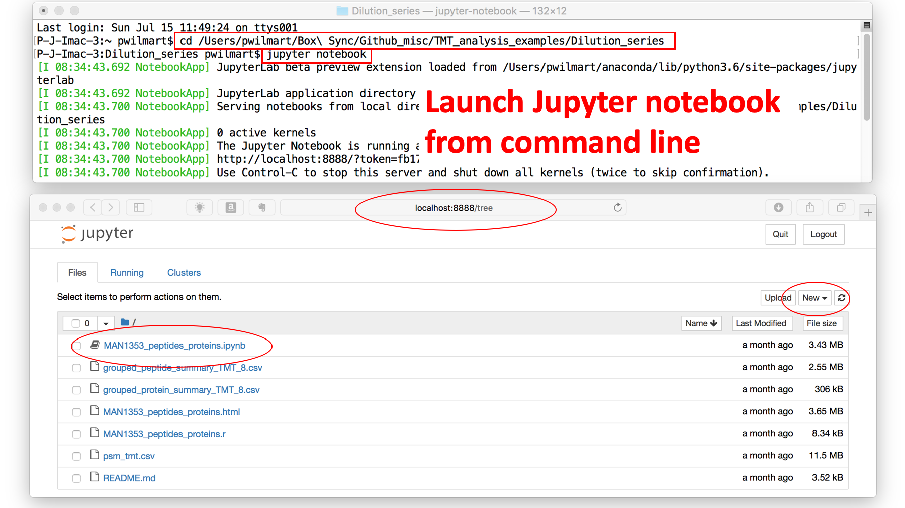

Before we can play with Jupyter notebooks, we have to get the web server up and running. The top window is a terminal window on my Mac. I move to the folder where I am going to be working (the "cd" command) and then launch a Jupyter notebook server (the "jupyter notebook" command). We get some information on the server port and how to stop the server.

The command will usually launch a new browser window or new tab in an open browser window. Once in a while, you have to open a browser and then paste in the server URL. The bottom window shows the notebook in the Safari browser. We have a file tree view. There is already an existing notebook here (the ".ipynb" file extension) that we could double click to continue working on, or we can use the new menu to create a new, untitled notebook. We have to select the programming language we want the new notebook associated with.

---

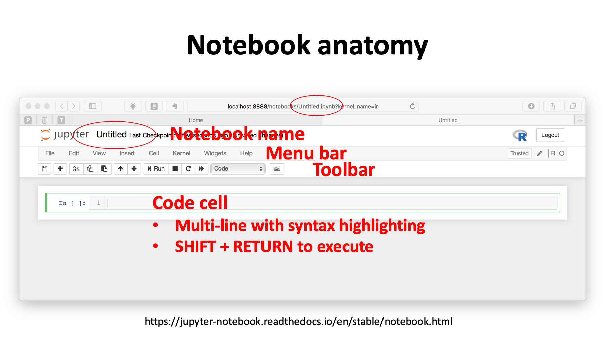

Here is a new notebook starting window. It is an "untitled" notebook. We can change the name by directly editing the name (left red oval) or through the "File" menu in the Menu bar. The menu bar has some other useful commands such as splitting or merging cells ("Edit" menu), adding cells above or below ("Insert" menu), and run all cells ("Cell" menu). There is a toolbar and the upper right logo tells us that this is an R language notebook.

New notebooks open with a single code cell. Code cells can contain one or more lines of computer code, and it will be nicely syntax highlighted. When you want to execute the code block, you hit the SHIFT plus ENTER/RETURN keys.

---

If all notebooks could do was execute code blocks, that would not be very interesting, and we have many other ways to do that. What makes notebooks good communication tools are the markdown text cells and the ability to show graphical output. The markdown cells let you tell a full and complete data analysis story to go along with the code cells.

Here is a typical introductory Markdown cell for a data analysis notebook. This is the markdown cell in its "edit" mode. Markdown is used in many contexts (Jupyter markdown, R markdown, Github markdown, etc.). The exact syntax varies but they are all pretty similar, and are designed to be an easier way to do some basic HTML formatting. The "#" (pound sign) characters denote header levels. Text is just typed as is. Bold or italic emphasis can be added, tables inserted, lists added, links to URLs or to other parts of the document added. Links to images, video files, or other web content can be added. Indented text is a nice way to do mini bibliographies.

---

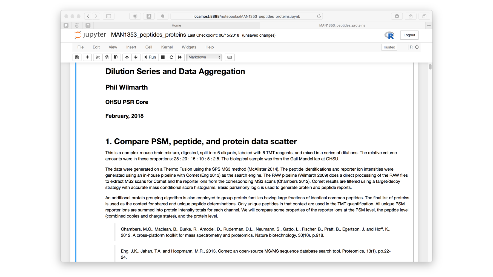

If we run the cell by doing the SHIFT+ENTER, we get the rendered output. It is easy to create nice looking documents. Equations can also be supported if LaTex is installed on your computer.

---

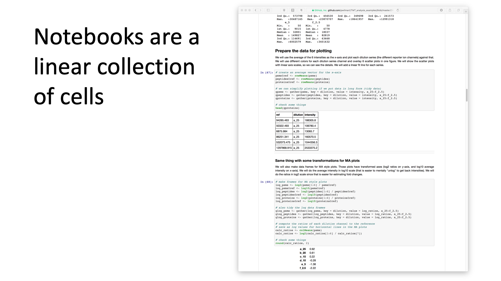

Notebooks are a linear collection of cells. Here we have (from top to bottom): some output from a previous code cell, a markdown cell, another code cell, some output, another markdown cell, another code cell, and some more output.

---

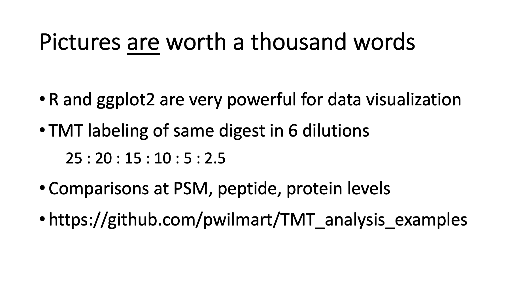

Text output is not too exciting. Pictures **are** worth a thousand words. Data visualizations are the main reason to use R, especially the ggplot2 package (the grammar of graphics). In the next few slides, we will look at some TMT labeling data where a mouse brain prep was digested, split into 6 aliquots, labeled with TMT reagents, mixed in a 25 to 20 to 15 to 10 to 5 to 2.5 set of dilutions, and analyzed on a Thermo Fusion using the SPS MS3 method.

Recovering the dilution series factors is rather trivial. The SPS MS3 data is very accurate. What is more interesting is seeing how the data quality varies as we go from PSMs to peptides to proteins. As we go from individual scans to proteins, we can aggregate more and more and see if that improves the data. The full notebook can be found at this URL on Github.

---

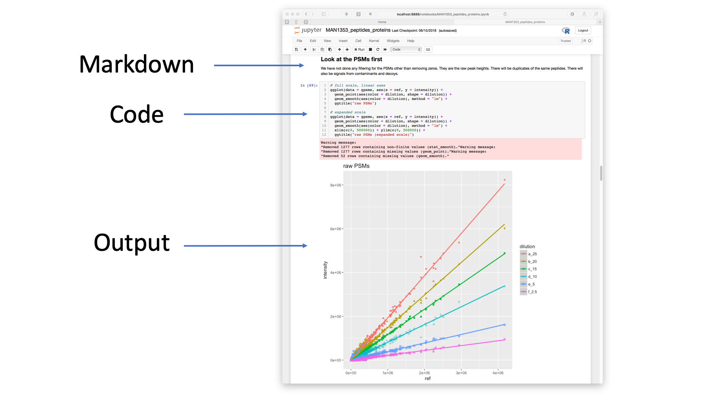

Let's start with the PSMs. Here is part of the notebook. I made a vector that is the average of the 6 dilution series vectors to use as the x-axis for plotting purposes. The code cell has R commands to create two plots. The first plot is shown in the output cell. The different dilutions create the spoke like pattern where the slopes are the dilution factors. Each dilution series is in a different color, with a different plot symbol, has a linear fit line (in a matching color), a key, axis labels, gridlines, and a title. That takes just 4 lines of code. Each of the 6 PSM dilution series vectors is about 60,000 points to plot!

---

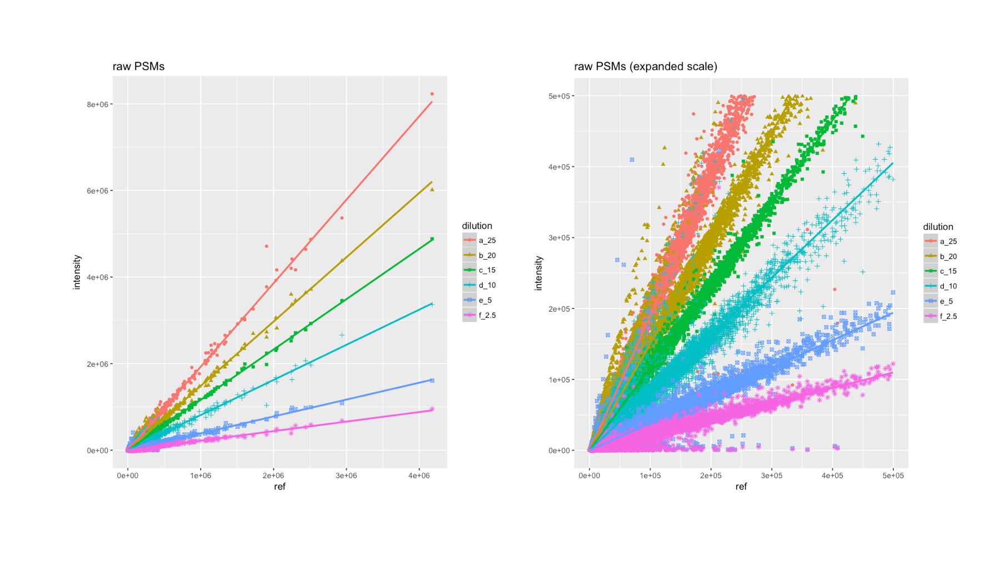

Since the data series converge on the origin, the plot in the lower left corner is pretty busy. We can very easily create a second plot with expanded axes scales (shown on the right). We can see that the series are still separated from each other, but the data is getting noisier as the intensities get smaller. The TMT reporter ion data is the reporter ion peak height (intensity).

---

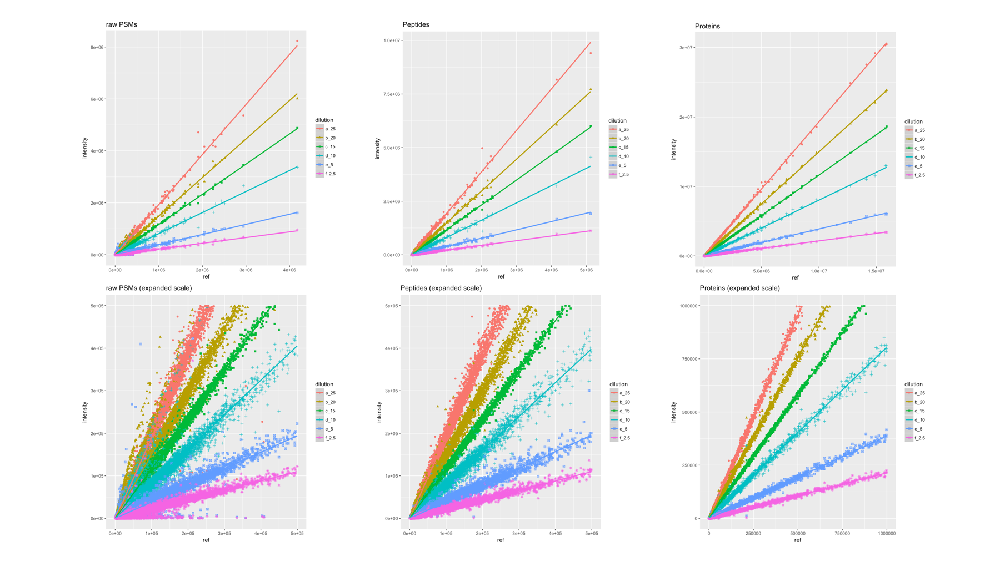

As was alluded to a few slides ago, the effect of aggregation on the data as we go from PSMs to peptides to proteins is interesting to look at. The aggregation function being used is simple summation. All of the reporter ion intensities from each PSM that map to the same peptide sequence are summed to make the peptide level data. After we have done the protein inference, we can sum the reporter ions from all unique peptides into protein intensity totals. Here we have 60K PSMs on the left, 20K peptides in the middle, and 2.7K protein on the right. The top row are the full scale plots and the bottom row are the expanded scales. We can clearly see that the data quality (the scatter in the data around the linear fit lines) improves as a function of aggregation. The protein data are very "tight", and the dilution series are very well separated. Remember that the differences in loading amount between series often correspond to small fold-changes. The number of data points is also reduced 22-fold going from PSMs to proteins. The median CVs are about twice as large for PSMs or peptides compared to proteins (data not shown).

---

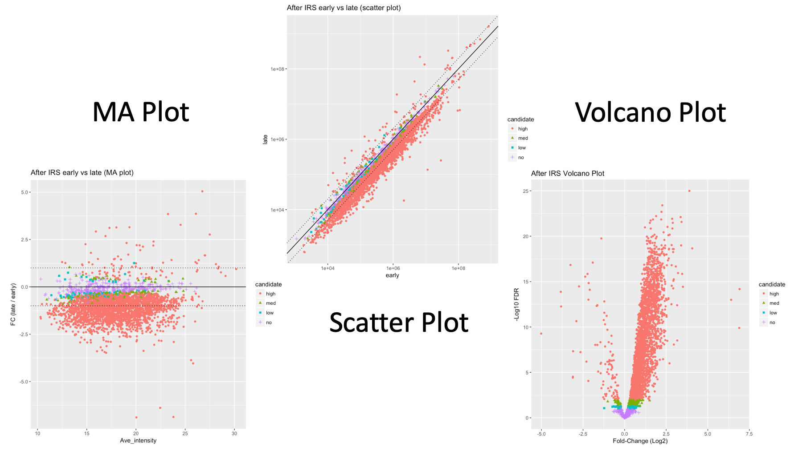

In addition to different views of the same plot (expanded axes, linear or log scales, etc.), it does not take much more effort to make different plot types from the same data. This is some data from a mouse lens developmental study published in 2017. There were 6 time points, two embryoinic and 4 postnatal. The time points were each 3 days apart. There were three biological replicates done in independent experiments. I took the early time data and compared it to the late time data. We know that a small number of lens proteins will get over expressed and push down the expression levels of everything else. The Bioconductor package edgeR was used to test for differential expression (DE) and the proteins are classified as not DE, low DE significance, medium, or high significance based on FDR (BH-corrected p-values).

If you have done some genomics, you might like the MA plot style on the left. If you like more traditional statistical plots, you might favor the volcano plot on the right. Basic x-y scatter plots (center) are also a mainstay of exploratory statistics. I like the scatter plots because both axes are in natural measurement scales. The other plots have transformed axes. Since you do not know what plots your audience will prefer, you can hedge your bets by showing multiple plot types. R has many plot types and plot packages, so do not get too crazy...

---

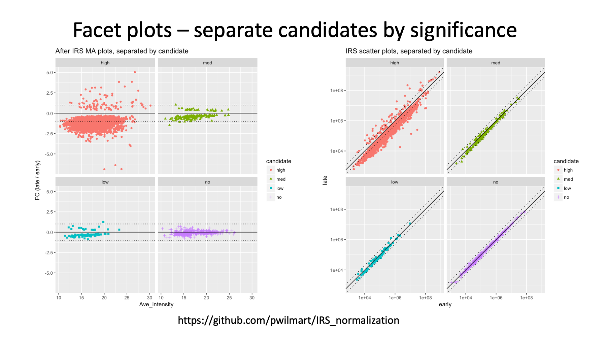

The data (about 3000 protein-level TMT intensities) are color coded by DE status. That can be a little hard to see in detail for the MA and scatter plots. Ggplot2 has a feature called facet plots where data plots can be pulled apart and each category of data examined by itself. The colors and plot symbols stay the same, and the axis limits are kept the same for easy comparisons. You can also control how the panels are arranged.

The upper left MA plot for the highly significant candidates makes it easy to see that a small number of proteins are up regulated (the lens-specific proteins above the black line) and that all of the other proteins are pushed down in expression. These experiments always label the same total amount of proteins. They are like teeter-totters (seesaws); if something goes up, something else must go down.

---

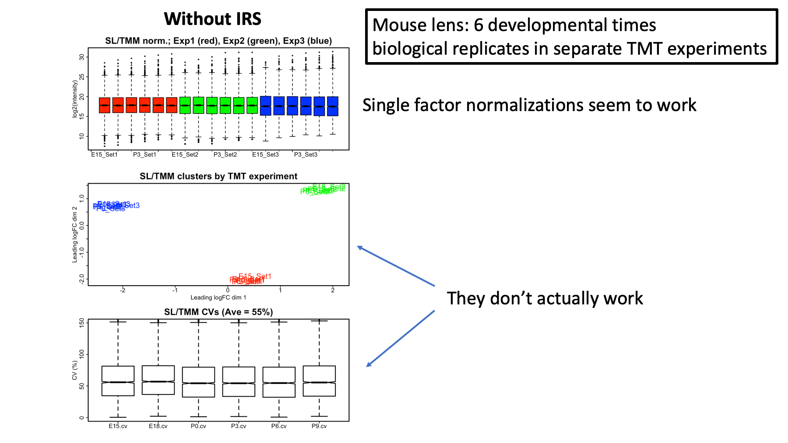

I have one more example of why different plots of the same data are very important. Sometimes a view of the data does not really tell you as much as you think. Other views might be needed to get the whole story. Ignorance of the data is no excuse...

This is still the developing mouse lens data that I presented at ASMS this June (www.github.com/pwilmart/ASMS2018). Each set of 6 time points was done in an independent TMT experiment. There were no common channels or reference standards used. Single factor, global scaling normalizations (the usual way we normalize stuff) were used to make the channels within each TMT as similar as possible and to make the channels between TMT experiments also as similar as possible.

One of the most common types of plots for evaluating data normalizations is the box plot. Here we have the distributions of the log2 protein intensities. The first TMT experiment data are in red, the second in green, and the third in blue. The desired pattern is to have all of the boxes in a nice horizontal line. These box plots look great, or do they?

Batch effects are common in genomics experiments and some type of a clustering view is often used to verify that the samples group by biological condition (i.e. treatment versus control) rather than by some arbitrary non-biological factor (e.g. by date of experiment). The multi-dimensional scaling plot (part of the limma Bioconductor package) shows that the data cluster very strongly by TMT experiment. Furthermore, since we have three replicates at each time point, we can compute protein coefficients of variance (CVs) at each time point and plot the distributions of those. The average median CV of 55% is not good at all.

---

A paper we published last May in Molecular & Cellular Proteomics (Plubell, et al.) introduced an internal reference scaling (IRS) method for multiple TMT experiment study designs. The reason the data between TMT experiments is so poor despite standard normalization techniques, is due to random MS2 sampling. Individual PSMs are somewhat randomly selected in shotgun instrument methods.

> Liu, H., Sadygov, R.G. and Yates, J.R., 2004. A model for random sampling and estimation of relative protein abundance in shotgun proteomics. Analytical chemistry, 76(14), pp.4193-4201.

This means that the reporter ions within each single scan have high precision, but the overall magnitude of the reporter ions between scans (of the same peptide sequence) can be all over the map. Therefore, sums of wildly varying PSM reporter ions will give rise to wildly varying peptide and protein totals. Note that the relative precision of reporter ions to each other in the same TMT plex will be preserved.

If we put something identical (an internal reference) in each TMT plex, we should measure the same value for each protein in each TMT plex. We will not get the same values due to random MS2 sampling; however, we can average our reference values and see how much each one was distorted (different from the average). We can then "un-distort" the data (the scaling factors) and undo the random MS2 sampling effect. See www.github.com/pwilmart/IRS_normalization for more details.

We can look at the same three plots after doing an IRS-like correction (this data lacked reference standards). The box plot looks very similar. It already looked great and we can't do much to make it even more greater... The cluster plot no longer groups by TMT experiment and, instead, groups by developmental time. The protein CVs have been reduced to 13%, a very low value.

---

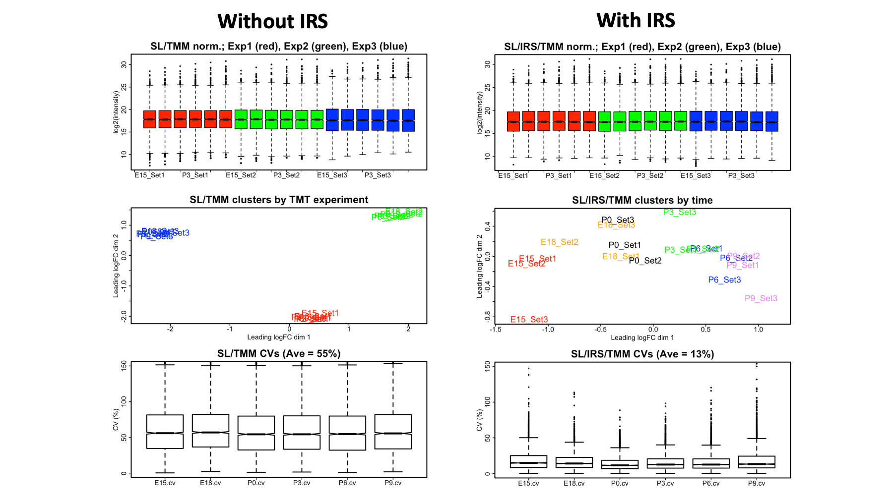

Here, I just show both sets of 3 plots side-by-side to make the comparison easier to see. The top box plots look nearly the same, and these sample-wide distribution of intensity views obscure what is going on at the individual protein level. The cluster plots and CV distributions are much better at probing what is going on with individual proteins. With the IRS method, it is almost like you have 18-plex TMT reagents!

---

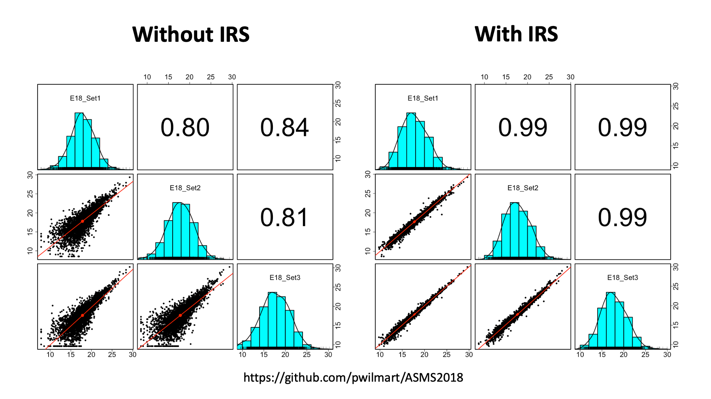

But wait. R has many more ways to visualize data. We have three replicates at each time point. We can pick each time point and see how similar the biological replicates are to each other. We can use a function from the "psych" package to do multi-panel scatter plots. With a single line of code, we can get the 9-panel plots. We can compare without IRS (left) to with IRS (right).

The lower diagonal is each replicate scatter plotted against the other replicates. The red line is a linear fit. The upper diagonals are the correlation coefficients. The diagonal shows the histogram of the log2 intensity distribution, a kernel density smoother, and a rug plot. The data on the right are obviously much better than the data on the left. If the normalization works correctly, each biological replicate should be similar to the others, independent of which TMT experiment it comes from.

---

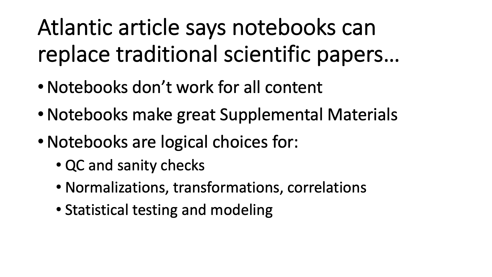

The Atlantic article predicts the demise of the scientific paper, and its replacement by notebooks. I do not think we are quite there yet (if that is even possible). However, notebooks would make great supplemental files for critical parts of the data analyses that are often rather poorly described in current papers. The biological samples and processing are usually done well. Since the MCP 2004 guidelines for publishing proteomics data, mass spectrometer and chromatography steps are typically detailed adequately. Most papers also describe search program settings and protein databases accurately. The normalization of quantitative data and statistical testing steps are probably the most poorly described parts of data analyses. This is an area that can be ideally addressed by notebooks.

Notebooks can be developed as templates for quality control, normalizations, and statistical testing, and easily modified for new experiments. This would enable more rapid assessment that the sample processing and mass spectrometry worked correctly. The visualizations available for evaluating the sanity of differential expression candidates is important to do before time and money is spent on validation efforts. Or before trying to convince reviewers that your data analysis was performed correctly.

---   

Notebooks are really powerful; however, power does not come cheaply. There can be a tremendous amount of learning involved and that can take a lot of time. This is time that will not directly further your career, so you have to be very careful about the time spent. All of these topics have multiple books written about them, and very extensive online documentation. I find Python to be a more intuitive computer language to learn, but Python 3 is more complicated that Python 2 was. The scientific extensions are extensive. R is not much like other computer languages and learning how to be effective at coding in R can be a **lengthy** journey.

I did not have any time to talk about version control, another key component in reproducible research, but Git and Github are also big topics with lots to learn. All of these topics are pretty central to "data science", an emerging field, and this is where I have learned about them. The folks listed here are some of the key people to pay attention to in data science. Hadley is one of the most influential R programmers (ggplot2 and the tidyverse), Wes wrote the pandas table manager package for Python, and Jake has written the Altair visualization package for Python (and is local).

---

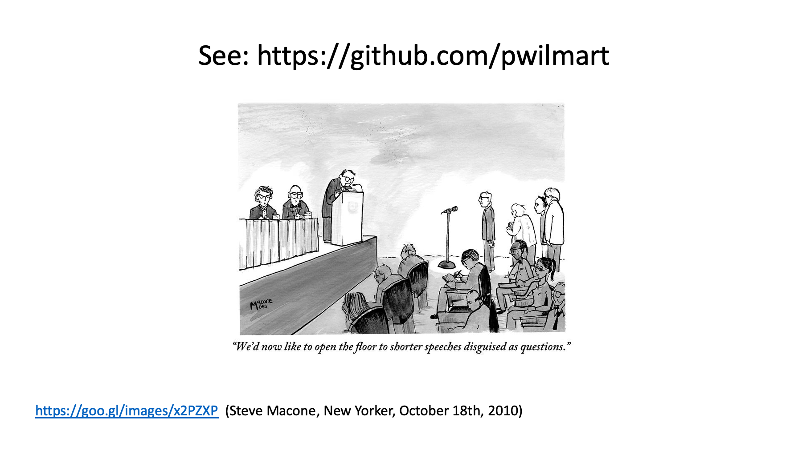

Thank you for your time and attention. Please visit the Github site for complete notebook examples and more.

---
---
